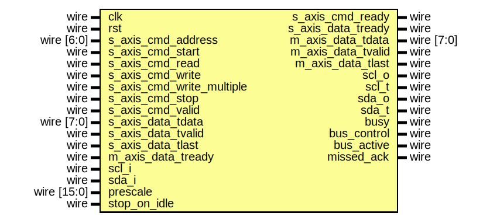
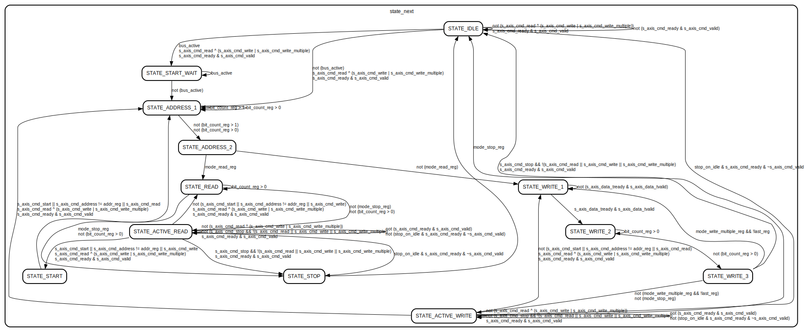
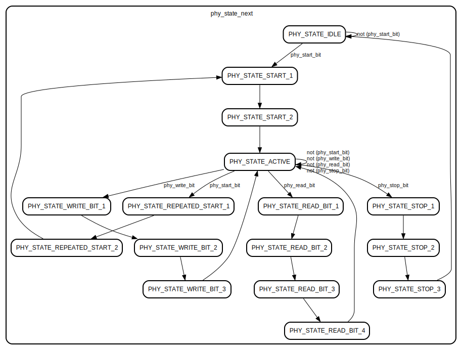

# Entity: i2c_master 
- **File**: i2c_master.v

## Diagram

## Ports

| Port name                 | Direction | Type        | Description |
| ------------------------- | --------- | ----------- | ----------- |
| clk                       | input     | wire        |             |
| rst                       | input     | wire        |             |
| s_axis_cmd_address        | input     | wire [6:0]  |             |
| s_axis_cmd_start          | input     | wire        |             |
| s_axis_cmd_read           | input     | wire        |             |
| s_axis_cmd_write          | input     | wire        |             |
| s_axis_cmd_write_multiple | input     | wire        |             |
| s_axis_cmd_stop           | input     | wire        |             |
| s_axis_cmd_valid          | input     | wire        |             |
| s_axis_cmd_ready          | output    | wire        |             |
| s_axis_data_tdata         | input     | wire [7:0]  |             |
| s_axis_data_tvalid        | input     | wire        |             |
| s_axis_data_tready        | output    | wire        |             |
| s_axis_data_tlast         | input     | wire        |             |
| m_axis_data_tdata         | output    | wire [7:0]  |             |
| m_axis_data_tvalid        | output    | wire        |             |
| m_axis_data_tready        | input     | wire        |             |
| m_axis_data_tlast         | output    | wire        |             |
| scl_i                     | input     | wire        |             |
| scl_o                     | output    | wire        |             |
| scl_t                     | output    | wire        |             |
| sda_i                     | input     | wire        |             |
| sda_o                     | output    | wire        |             |
| sda_t                     | output    | wire        |             |
| busy                      | output    | wire        |             |
| bus_control               | output    | wire        |             |
| bus_active                | output    | wire        |             |
| missed_ack                | output    | wire        |             |
| prescale                  | input     | wire [15:0] |             |
| stop_on_idle              | input     | wire        |             |

## Signals

| Name                                      | Type       | Description |
| ----------------------------------------- | ---------- | ----------- |
| state_reg = STATE_IDLE                    | reg [4:0]  |             |
| state_next                                | reg [4:0]  |             |
| phy_state_reg = STATE_IDLE                | reg [4:0]  |             |
| phy_state_next                            | reg [4:0]  |             |
| phy_start_bit                             | reg        |             |
| phy_stop_bit                              | reg        |             |
| phy_write_bit                             | reg        |             |
| phy_read_bit                              | reg        |             |
| phy_release_bus                           | reg        |             |
| phy_tx_data                               | reg        |             |
| phy_rx_data_reg = 1'b0                    | reg        |             |
| phy_rx_data_next                          | reg        |             |
| addr_reg = 7'd0                           | reg [6:0]  |             |
| addr_next                                 | reg [6:0]  |             |
| data_reg = 8'd0                           | reg [7:0]  |             |
| data_next                                 | reg [7:0]  |             |
| last_reg = 1'b0                           | reg        |             |
| last_next                                 | reg        |             |
| mode_read_reg = 1'b0                      | reg        |             |
| mode_read_next                            | reg        |             |
| mode_write_multiple_reg = 1'b0            | reg        |             |
| mode_write_multiple_next                  | reg        |             |
| mode_stop_reg = 1'b0                      | reg        |             |
| mode_stop_next                            | reg        |             |
| delay_reg = 16'd0                         | reg [16:0] |             |
| delay_next                                | reg [16:0] |             |
| delay_scl_reg = 1'b0                      | reg        |             |
| delay_scl_next                            | reg        |             |
| delay_sda_reg = 1'b0                      | reg        |             |
| delay_sda_next                            | reg        |             |
| bit_count_reg = 4'd0                      | reg [3:0]  |             |
| bit_count_next                            | reg [3:0]  |             |
| s_axis_cmd_ready_reg = 1'b0               | reg        |             |
| s_axis_cmd_ready_next                     | reg        |             |
| s_axis_data_tready_reg = 1'b0             | reg        |             |
| s_axis_data_tready_next                   | reg        |             |
| m_axis_data_tdata_reg = 8'd0              | reg [7:0]  |             |
| m_axis_data_tdata_next                    | reg [7:0]  |             |
| m_axis_data_tvalid_reg = 1'b0             | reg        |             |
| m_axis_data_tvalid_next                   | reg        |             |
| m_axis_data_tlast_reg = 1'b0              | reg        |             |
| m_axis_data_tlast_next                    | reg        |             |
| scl_i_reg = 1'b1                          | reg        |             |
| sda_i_reg = 1'b1                          | reg        |             |
| scl_o_reg = 1'b1                          | reg        |             |
| scl_o_next                                | reg        |             |
| sda_o_reg = 1'b1                          | reg        |             |
| sda_o_next                                | reg        |             |
| last_scl_i_reg = 1'b1                     | reg        |             |
| last_sda_i_reg = 1'b1                     | reg        |             |
| busy_reg = 1'b0                           | reg        |             |
| bus_active_reg = 1'b0                     | reg        |             |
| bus_control_reg = 1'b0                    | reg        |             |
| bus_control_next                          | reg        |             |
| missed_ack_reg = 1'b0                     | reg        |             |
| missed_ack_next                           | reg        |             |
| scl_posedge = scl_i_reg & ~last_scl_i_reg | wire       |             |
| scl_negedge = ~scl_i_reg & last_scl_i_reg | wire       |             |
| sda_posedge = sda_i_reg & ~last_sda_i_reg | wire       |             |
| sda_negedge = ~sda_i_reg & last_sda_i_reg | wire       |             |
| start_bit = sda_negedge & scl_i_reg       | wire       |             |
| stop_bit = sda_posedge & scl_i_reg        | wire       |             |

## Constants

| Name                       | Type | Value | Description |
| -------------------------- | ---- | ----- | ----------- |
| STATE_IDLE                 |      | 4'd0  |             |
| STATE_ACTIVE_WRITE         |      | 4'd1  |             |
| STATE_ACTIVE_READ          |      | 4'd2  |             |
| STATE_START_WAIT           |      | 4'd3  |             |
| STATE_START                |      | 4'd4  |             |
| STATE_ADDRESS_1            |      | 4'd5  |             |
| STATE_ADDRESS_2            |      | 4'd6  |             |
| STATE_WRITE_1              |      | 4'd7  |             |
| STATE_WRITE_2              |      | 4'd8  |             |
| STATE_WRITE_3              |      | 4'd9  |             |
| STATE_READ                 |      | 4'd10 |             |
| STATE_STOP                 |      | 4'd11 |             |
| PHY_STATE_IDLE             |      | 5'd0  |             |
| PHY_STATE_ACTIVE           |      | 5'd1  |             |
| PHY_STATE_REPEATED_START_1 |      | 5'd2  |             |
| PHY_STATE_REPEATED_START_2 |      | 5'd3  |             |
| PHY_STATE_START_1          |      | 5'd4  |             |
| PHY_STATE_START_2          |      | 5'd5  |             |
| PHY_STATE_WRITE_BIT_1      |      | 5'd6  |             |
| PHY_STATE_WRITE_BIT_2      |      | 5'd7  |             |
| PHY_STATE_WRITE_BIT_3      |      | 5'd8  |             |
| PHY_STATE_READ_BIT_1       |      | 5'd9  |             |
| PHY_STATE_READ_BIT_2       |      | 5'd10 |             |
| PHY_STATE_READ_BIT_3       |      | 5'd11 |             |
| PHY_STATE_READ_BIT_4       |      | 5'd12 |             |
| PHY_STATE_STOP_1           |      | 5'd13 |             |
| PHY_STATE_STOP_2           |      | 5'd14 |             |
| PHY_STATE_STOP_3           |      | 5'd15 |             |

## Processes
- unnamed: ( @* )
  - **Type:** always
- unnamed: ( @* )
  - **Type:** always
- unnamed: ( @(posedge clk) )
  - **Type:** always

## State machines

